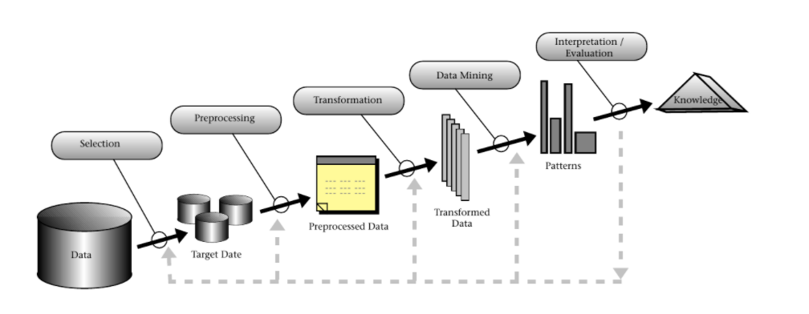

# Projeto `Características das cidades brasileiras e efetividade das estratégias adotadas para enfrentamento da epidemia de COVID-19.`
# Project `Characteristics of Brazilian cities and effectiveness of the strategies adopted to confront the COVID-19 epidemic.`

# Apresentação

O presente projeto foi originado no contexto das atividades da disciplina de pós-graduação [*Ciência e Visualização de Dados em Saúde*](https://github.com/datasci4health/home), oferecida no primeiro semestre de 2021, na Unicamp.

> |Nome  | RA | Especialização|
> |--|--|--|
> | Igor Mateus Omote  | 169819  | Computação|
> | Larissa Maria Lago Quintela  | 160343  | Elétrica|
> | Marcos Vinicius Soares Silva  | 224692  | Saúde|
> | Nádia Maria Soares Bezerra  | 187940  | Saúde|

# Descrição Resumida do Projeto
A pandemia de COVID-19 em curso há mais de um ano tem concentrado preocupações e esforços mundiais no sentido de reduzir o número de contaminados e de mortes causadas pela infecção. Atualmente, o Brasil figura como o quinto país no ranking mundial de novas mortes por milhão de habitantes (1), demonstrando o quão ineficazes têm sido as estratégias adotadas nacionalmente para o controle da epidemia no país. Diante deste cenário, as estratégias adotadas localmente por gestores estaduais e municipais ganham destaque no enfrentamento à COVID-19, e também se tornam alvo de críticas e questionamentos na medida em que o controle da epidemia tem sido mal sucedido nas mais diversas cidades. Apesar da estratégia de vacinação já estar em curso, esta medida só foi implementada em janeiro de 2021 e ainda não está disponível para toda a população brasileira, ou seja, outras estratégias continuam sendo necessárias para redução dos riscos e dos danos causados pela transmissão descontrolada do vírus SARS-Cov-2. Mas, que medidas são essas capazes amenizar os impactos negativos da COVID-19 e que, mesmo após um ano de pandemia, ainda não estão eficazmente implementadas e ainda despertam dúvidas sobre seus efeitos? Lockdown, tratamento precoce, desinfecção de locais públicos e barreiras sanitárias são exemplos de estratégias adotadas por governos e prefeituras, mas algumas geram controvérsias. Em um cenário de “infodemia” e polarização política, torna-se ainda mais difícil entender quais medidas de fato têm se mostrado essenciais para algum nível de controle e redução do número de casos de infectados e mortos por COVID-19 no Brasil. Um levantamento das principais estratégias adotadas pelos gestores locais até aqui e a sua relação com o número de pacientes infectados e mortes por COVID-19 nas cidades brasileiras é a principal proposta deste projeto, que considera, ainda, as características socioeconômicas destas cidades possivelmente relacionadas com o sucesso ou o fracasso das medidas implementadas. 

(1)https://infograficos.gazetadopovo.com.br/saude/ranking-do-coronavirus-por-paises-mortes-por-milhao/

> Link para vídeo de apresentação da proposta do projeto (máximo 3 minutos).

# Perguntas de Pesquisa
* Qual combinação de estratégias de controle da epidemia utilizadas pelo gestor municipal está relacionada com menor número de contaminados e de mortes por COVID-19 nas cidades brasileiras?
* Lockdown, tratamento precoce, rastreamento de contatos, testagem em massa, desinfecção de locais públicos e barreiras sanitárias em portos, aeroportos e fronteiras são estratégias decisivas para redução do número de contaminados e de mortes por COVID-19 nas cidades brasileiras?
* O IDH e a cobertura de saneamento básico das cidades brasileiras são fatores que impactaram no número de contaminados e de mortes por COVID-19 em 2020? 

# Bases de Dados
Para responder as perguntas elencadas, as fontes de dados foram divididas em 3 grandes grupos:

## **Grupo 1** - referente ao estado anterior à COVID-19 das cidades brasileiras:
* [DataSus](http://tabnet.datasus.gov.br/cgi/idb2012/matriz.htm#socio) - indicadores demográficos, socioeconômicos, de mortalidade, fatores de risco e proteção, e de recursos.
* [IBGE 1](https://dadosgeociencias.ibge.gov.br/portal/sharing/rest/content/items/e537f2bbd43743198f99c77dfc878bff/data) e [IBGE 2](https://dadosgeociencias.ibge.gov.br/portal/apps/webappviewer/index.html?id=67c70e701c624c63a6f1754a8b8bce4a) - Ambos apresentam o estudo de aglomerados subnormais. Isto é, aglomerados populacionais caracterizados, em geral, por um padrão urbanístico irregular, carência de serviços públicos essenciais e localização em áreas com restrição a ocupação. 
* [IBGE 3](https://dadosgeociencias.ibge.gov.br/portal/apps/webappviewer/index.html?id=be5ba503eead453aaa6e1f318b374b76) - A informação sobre o percentual da população com 60 anos ou mais de idade foi produzida a partir dos dados do Censo Demográfico 2010. 
* [Trata Brasil](http://www.tratabrasil.org.br/images/estudos/Ranking_saneamento_2021/Relat%C3%B3rio_-_Ranking_Trata_Brasil_2021_v2.pdf) - utiliza a base de dados da SANIS, fonte mais completa sobre o setor de saneamento no Brasil. O sistema reúne informações de prestadores estaduais, regionais e municipais de serviços de acesso à água, coleta e tratamento de esgoto, além de resíduos sólidos. Desta forma, o estudo calcula 12 indicadores diferentes (ver metodologia) e atribui notas, construindo assim um ranking entre os municípios brasileiros avaliando o serviço de saneamento básico.

## **Grupo 2** - Medidas adotadas pelo estado para contenção da COVID-19
Ainda não foi coletada, mas pretende-se fazer um web crawler nos principais sites de notícias ([G1](https://g1.globo.com/), [Estadão](https://www.estadao.com.br/), [El Pais](https://brasil.elpais.com/), [Carta Capital](https://www.cartacapital.com.br/), [Veja](https://veja.abril.com.br/), [Folha](https://www.folha.uol.com.br/) etc.) para buscar o dado mais granular possível, caso não haja nenhuma informação da cidade, a alternativa é buscar nos sites oficiais de cada um dos governos sobre informações de contenção e extrapolar para a cidade. Tal aproximação é semelhante ao preenchimento de dados vazios com o valor da média ou moda da distribuição.

## **Grupo 3** - referente ao estado das cidades brasileiras durante a pandemia (número de contaminados, mortes, distribuição de respiradores, sintomas leves/graves..)
* [Coleta manual disponbilizada](https://docs.google.com/spreadsheets/d/1RkovtMc-o7fGdGf5SBR8kYWQQCsTn-7CdACsUgJHLxI/edit#gid=1621510199) - essa planilha foi coletada manualmente por um pesquisador e revisado por outro. 
* [Repositório do Github](https://github.com/wcota/covid19br) -  estudo anterior que reuniu dados de contaminação e morte no Brasil.
* [Governo brasileiro](https://dados.gov.br/dataset/distribuicao-de-respiradores#)  lá tem quantos respiradores foram entregues a cada estado em qual data, se soubermos a quantidade de respiradores no momento 0, saberemos quantos respiradores tiveram a cada momento
# Metodologia
O pipeline seguido por este estudo será o KDD presente na figura abaixo. A partir do entendimento do problema macro, é possível traçar os objetivos da pesquisa. Assim, com as perguntas científicas formuladas, e a seleção dos bancos de dados promissores realizada, inicia-se a etapa de **data cleaning** e tratamento de dados faltantes. A transformação dos dados presentes será feita visando facilitar a validação de algumas hipóteses estabelecidas no início, neste ponto tem-se como opções a redução de dimensionalidade e a normalização por exemplo. A fase de **Data Mining** consiste tanto na aplicação de algoritmos utilizando conceitos de aprendizado de máquina como regressão, classificação e clustering quanto de análises estatísticas, como correlações e estatísticas descritivas. Finalmente, em **Interpretation / Evaluation** será possível gerar insights a partir das análises já realizadas. 

É válido ressaltar que este método é iterativo, desta forma, caso os bancos de dados coletados se mostrem insuficientes, novos serão coletados a fim de gerar insights mais expressivos.

# Ferramentas
O projeto será feito em [Python 3](https://www.python.org/), junto do [Jupyter Notebook](https://jupyter.org/). Para o tratamento de dados, utilizar-se-á de dataframes suportados pela biblioteca [Pandas](https://pandas.pydata.org/) ou em arrays suportados pela biblioteca [NumPy](https://numpy.org/). Os modelos serão treinados na biblioteca [Scikit-Learn](https://scikit-learn.org/stable/) ou pelo [TensorFlow](https://www.tensorflow.org/).

# Cronograma
A seguir, uma proposta de cronograma de qual a prioridade em cada semana, vale ressaltar que por ser envolver análises de diferentes bases de dados, que não foram preparados para responder às perguntas de pesquisa, há uma grande incerteza se haverá necessidade de coletar novos dados (de diferentes fontes) durante a execução do projeto; por conta disso, a cada semana poderá haver iterações dentro do cronograma variando a prioridade de cada etapa.

A etapa de DM(Data Mining) foi separada em 2 grandes passos: Análises descritivas e modelos de ML(Machine Learning).

|                             | 18/04 a 24/04  | 25/04 a 01/05 | 02/05 a 08/05 | 09/05 a 15/05 | 16/05 a 22/05 | 23/05 a 29/05 | 30/05 a 05/06 | 06/06 a 12/06 | 13/06 a 19/06 | 20/06 a 26/06 |
|-----------------------------|:--------------:|:-------------:|:-------------:|:-------------:|:-------------:|:-------------:|:-------------:|:-------------:|:-------------:|:-------------:|
| Selection                   | Alta           | Alta          | Baixa         | Baixa         | Baixa         | Baixa         | Baixa         | Baixa         | Baixa         | Baixa         |
| Transformation              |                |               | Alta          | Alta          | Média         | Média         | Média         | Média         | Baixa         | Baixa         |
| Data Mining                 |                |               | Baixa         | Média         | Alta          | Alta          | Alta          | Alta          | Média         | Média         |
| DM - Análises Descritivas   |                |               | Baixa         | Média         | Alta          | Alta          | Média         | Média         | Média         | Média         |
| DM - Modelos de ML          |                |               |               |               |               |               | Alta          | Alta          | Alta          | Média         |
| Interpretation / Evaluation |                |               | Média         | Média         | Média         | Alta          | Média         | Alta          | Alta          | Alta          |

<small>Project based on the <a target="_blank" href="https://drivendata.github.io/cookiecutter-data-science/">cookiecutter data science project template</a>. #cookiecutterdatascience</small>

Project Organization
------------

    ├── LICENSE
    ├── Makefile           <- Makefile with commands like `make data` or `make train`
    ├── README.md          <- The top-level README for developers using this project.
    ├── data
    │   ├── external       <- Data from third party sources.
    │   ├── interim        <- Intermediate data that has been transformed.
    │   ├── processed      <- The final, canonical data sets for modeling.
    │   └── raw            <- The original, immutable data dump.
    │
    ├── docs               <- A default Sphinx project; see sphinx-doc.org for details
    │
    ├── models             <- Trained and serialized models, model predictions, or model summaries
    │
    ├── notebooks          <- Jupyter notebooks. Naming convention is a number (for ordering),
    │                         the creator's initials, and a short `-` delimited description, e.g.
    │                         `1.0-jqp-initial-data-exploration`.
    │
    ├── references         <- Data dictionaries, manuals, and all other explanatory materials.
    │
    ├── reports            <- Generated analysis as HTML, PDF, LaTeX, etc.
    │   └── figures        <- Generated graphics and figures to be used in reporting
    │
    ├── requirements.txt   <- The requirements file for reproducing the analysis environment, e.g.
    │                         generated with `pip freeze > requirements.txt`
    │
    ├── setup.py           <- makes project pip installable (pip install -e .) so src can be imported
    ├── src                <- Source code for use in this project.
    │   ├── __init__.py    <- Makes src a Python module
    │   │
    │   ├── data           <- Scripts to download or generate data
    │   │   └── make_dataset.py
    │   │
    │   ├── features       <- Scripts to turn raw data into features for modeling
    │   │   └── build_features.py
    │   │
    │   ├── models         <- Scripts to train models and then use trained models to make
    │   │   │                 predictions
    │   │   ├── predict_model.py
    │   │   └── train_model.py
    │   │
    │   └── visualization  <- Scripts to create exploratory and results oriented visualizations
    │       └── visualize.py
    │
    └── tox.ini            <- tox file with settings for running tox; see tox.readthedocs.io
